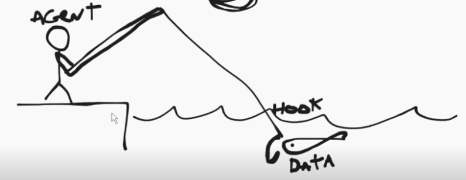
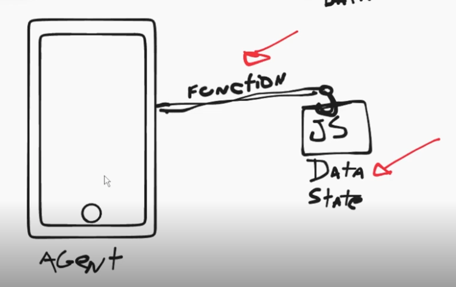
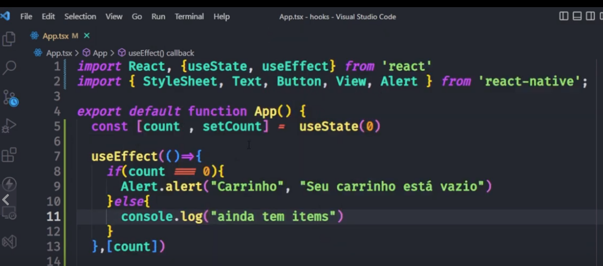
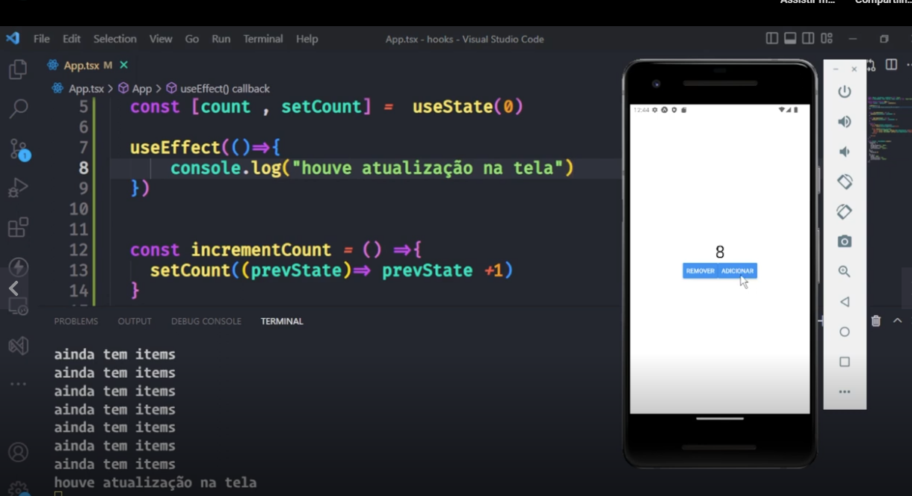
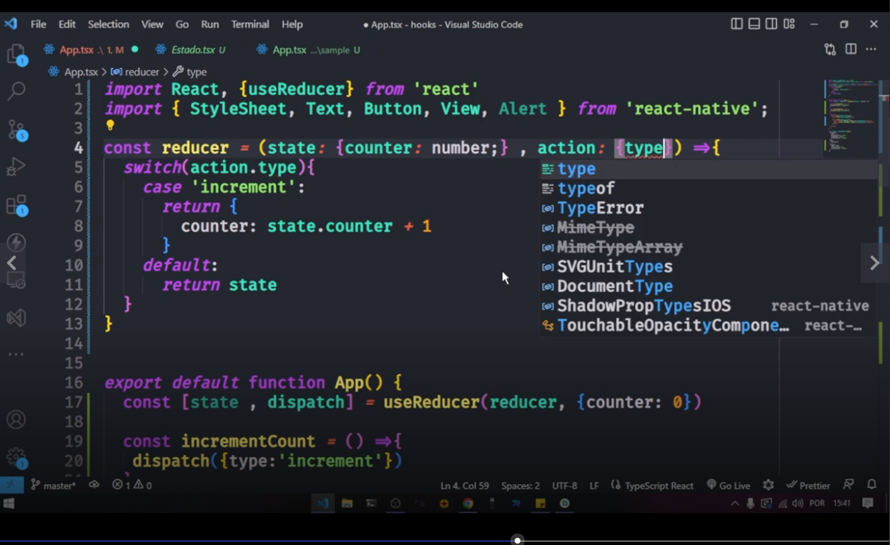
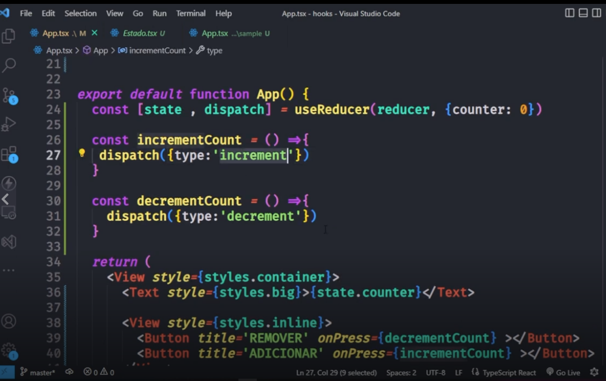
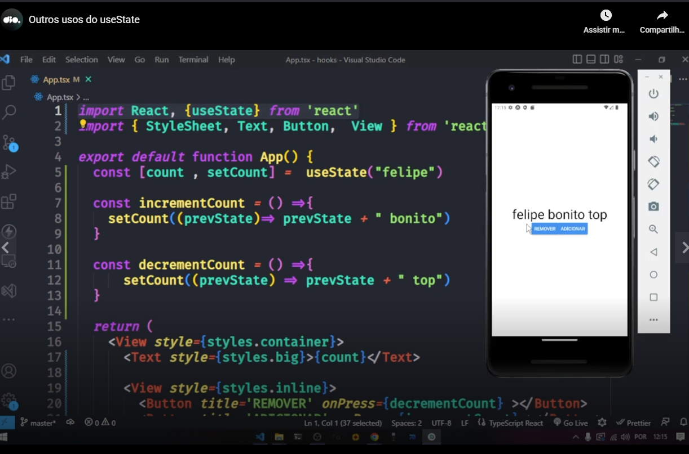
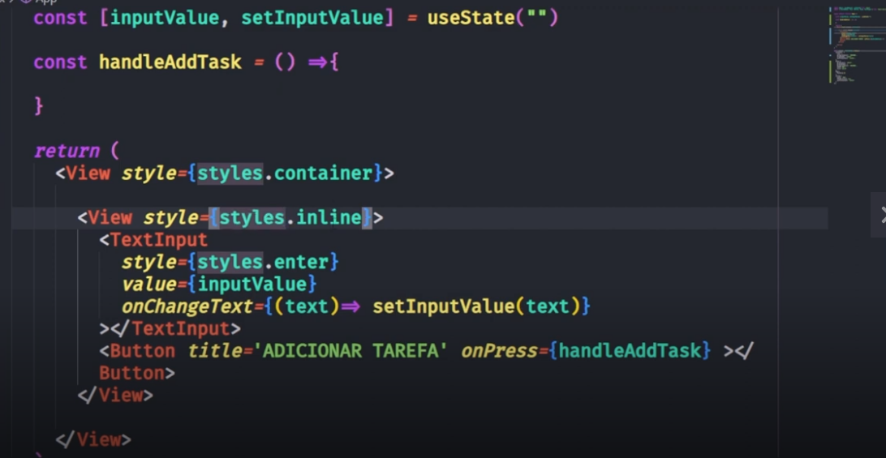
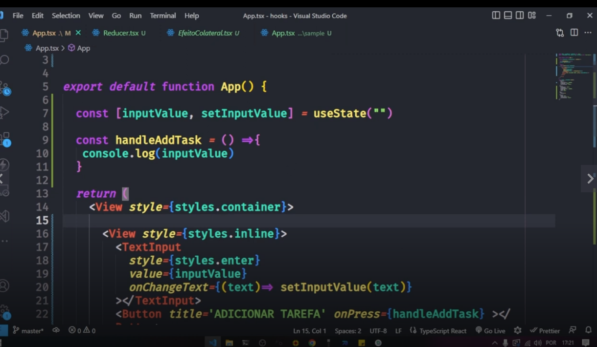
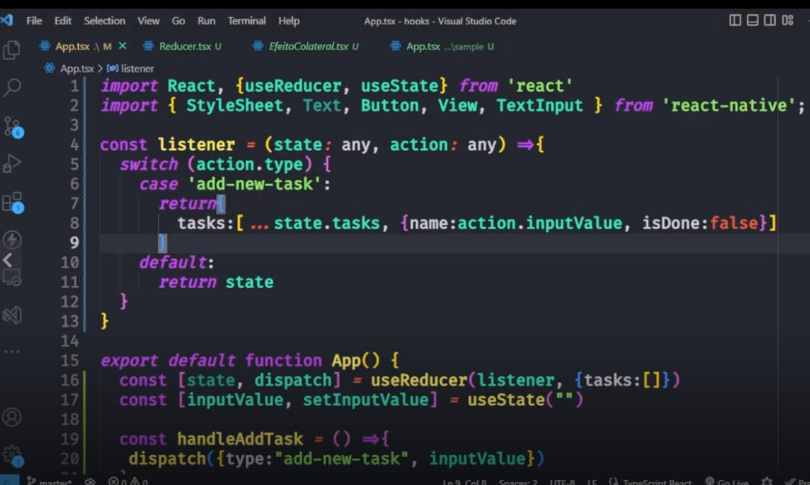

# Introduction

Teacher said that hooks were introduced in React on React 16.8 and are linked to **useState**, normally imported in the following format:

```
import React, { useState } from 'react';
```

Teacher said that we have to remember to import from React and not from React Native.

Teacher said that we also have the hook Use Effect.

Teacher also said that the code in React Native and in the React web is the same when we are talking about hooks.

Teacher said that the hook always return to us a function and a variable.

See the teacher analogy:



And please see the teacher explanation:



Teacher passed an example in in this simple example of an incrementer and decrementer, the hook worked similar a session in a "PHP world".

I created a test app (maybe more text apps in future) in "test/01/basic-hooks" directory.

I used the following command to create the app:

```
npx create-expo-app basic-hooks -t
```

And I entered in the created directory and executed this commmand:

```
npm run android
```

Please see in this example that we have to call a handler function and is this function that call the function you declared in the line that you declare the use of **useState**.


# Test app

Please see the test app I developed. Pay attention to things like:

- The use of use state (react hook);
- The non declaration of the function indicated on declare the use of useState.


# useEffect

Teacher said that that useEffect can be use to deal with side effects.

Here is an example of useEffect use:



Teacher also showed us that we do not need to monitor a variable.



OBS: Pay attention that we have the use of **useEffect** and **useState** in the previous image.


# useReducer

How to import:

```
import {useReducer} from 'react'
```

Declaring for the use:



Please see the line with the string "useReducer(reducer, {counter: 0})".

You also can see the function "reducer" in the image.

Please see these example images:





Comments:

- The onPress declaration on the different buttons ("Remover" or "Adcionar" in the images);
- These methods of the above item call the method dispatch indicated in the line that you declared the use of useReducer;
- See the second image. The "reducer" function receives a second parameter.


# Example with 2 hooks

Teacher passed us an example with **useReducer** and **useState**.

Normal importing:

```
import React, {useReducer, useState} from 'react'
```

In this example you need to understand that you will interact with every key pressed in the text box and with the click in the button.

See in this example that you use **useState** on every pressed key in the text box, but you do not need to write the **setInputValue** function, only to declare it in the line where you call **useState**.



## Showing in the console the content of the text box



Who is **handleAddTask**. Is the invoked function on the button click. It showes in the console the value of the text box, but when the button is clicked.


# Official documentation

Teacher said that the official documentation is a great plave to study more abou React hooks:


[official documentation](https://reactjs.org/docs/hooks-intro.html)

Now please see the use of **useReducer**:



Explaining: 

1- you indicate the function **dispatch** in the line that you indicate the use of **useReducer**;
2- In the last line in the above image you can see the **dispatch** function being called;


# Repository related to the classes

[link](https://github.com/digitalinnovationone/trilha-react-native-hooks)